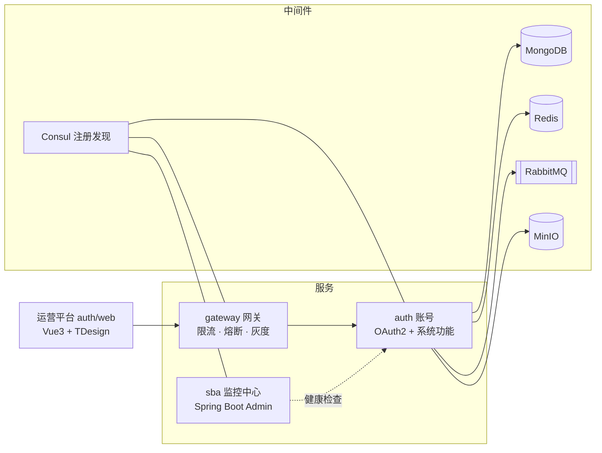

# cairo-platform

#### Cairo · 多租户 SaaS 微服务基础架构平台

[](https://github.com/lijiajia3515/cairo-platform/actions/workflows/ci.yml)


**Cairo**（cairo-platform）是一套多租户 SaaS 微服务基础架构平台：以 **[auth 账号](auth/README.md)** 为核心（OAuth2 + JWT + 多租户 RBAC + 系统功能一体化），配套网关、监控中心、框架库与 Starter 集合。单仓库、单 Gradle 构建，采用 Gradle 官方推荐的现代构建架构（约定插件 + 版本目录 + 原生 BOM）。

## 平台简介

- **前后端分离 + 微服务**：后端 Java 17 / Spring Boot 3.5 / Spring Cloud 2025，前端 Vue 3.5 / Vite 7 / TDesign。
- **认证授权一体化**：账号服务既是 OAuth2 授权服务器（Spring Authorization Server + JWT），也内置文件、短信、通知、字典、业务日志等系统功能，单服务部署（`cairo-auth`）。
- **多租户层级模型**：`Tenant -订阅-> App -> Endpoint -> Subapp`，围绕 6 类认证主体组织认证与授权。
- **MongoDB 核心存储**：71 个集合的结构与基线数据全部脚本化管理（`docs/auth/db/` 唯一权威源）。
- **工程化优先**：32 个 Gradle 子应用共享一套约定插件，子应用 `build.gradle` 通常只有 `plugins {}` + `dependencies {}` 两段；CI 全仓测试并产出 boot jar 与前端 dist。

## 架构总览



## 核心能力

### auth 账号（平台核心）

完整文档见 **[auth/README.md](auth/README.md)**，关键设计：

| 能力 | 说明 |
|------|------|
| [6 类主体模型](auth/README.md#主体模型) | `Client` / `Account` / `AppUser` / `SubappUser` / `TenantAppUser` / `TenantSubappUser`，对应多租户层级 `Tenant -> App -> Endpoint -> Subapp` |
| [三层认证链](auth/README.md#认证体系) | 登录认证（密码 / 验证码 / SNS / 主体关联）→ OAuth2 自定义 grant（`主体:方式` 格式，13 种 grant_type）→ 资源侧 JWT 校验链（6 个 Token Provider） |
| [双层权限模型](auth/README.md#权限模型双层) | `permissionId`（`资源.动作`，前端 `v-allow` 指令绑定）+ `authorities`（`资源:动作`，`@PreAuthorize` 校验），两层值 1:1 |
| [多租户 RBAC](auth/README.md#子应用结构) | 租户 / 应用两级角色、部门、用户标签、角色模板——service 层 45 个业务子应用 |
| [数据模型](auth/README.md#数据模型) | MongoDB 71 集合统一 `auth_` 前缀；短值标识 + 复合唯一索引 |
| [8 主体面 API](auth/README.md#api-层) | 同一资源按调用方视角拆分 Controller（`/open_api`、`/client_api`、`/cairo_web_manage_api` 等 8 个主体面前缀 + weboffice 特例面，164 控制器 / 698 端点），全量清单见 [api-surface.md](docs/auth/api-surface.md) |
| [消息拓扑](auth/README.md#消息拓扑rabbitmq) | Topic 交换机 + 各子应用「业务队列 + 绑定」两件套声明 |
| [对外输出](auth/README.md#对外输出) | domain（DTO）/ sdk（Feign）/ starter / BOM 四形态 Maven 坐标，供其他微服务集成 |

内置系统功能：文件（MinIO 直传 + imgproxy）、短信、微信公众号、通知、系统字典、行政区划与 ip2region、登录 / 业务日志、WebOffice 集成。

### gateway 网关

统一业务返回包装、Redis 限流、Resilience4j 熔断重试、标签灰度路由（自定义 LoadBalancer）、追踪响应头透传。详见 [gateway/README.md](gateway/README.md)。

### sba 监控中心

Spring Boot Admin：Consul 服务发现、独立管理端口、健康告警通知。详见 [sba/README.md](sba/README.md)。

### framework 框架库 + starter 集合

- `framework/`（10 子应用）：统一返回体 / 异常 / 分页、Jackson 脱敏、Redis key 前缀、MongoDB 命名策略与发号器、RabbitMQ 声明规范、Feign 错误解码 / 拦截器、自定义 LoadBalancer，含 dependencies BOM；
- `starter/`（7 子应用）：web / redis / mongodb / rabbitmq / xxljob 自动装配，含 dependencies BOM 与 `example` 示例应用。

### 现代构建架构

约定插件（build-logic included build）+ 版本目录（`libs.versions.toml`）+ 原生 BOM `platform()` + 集中仓库声明 + artifactId 名称推导，详见下文[构建架构](#构建架构)。

## 快速开始

### 环境要求

| 项目         | 要求                          | 说明                                  |
|--------------|-------------------------------|---------------------------------------|
| JDK          | 17+                           | Gradle 工具链统一                     |
| Node.js      | 24 LTS                        | 见 `.nvmrc`；pnpm 11 由 corepack 锁定 |
| Consul       | 服务注册 / 发现（启动硬依赖） | 必需                                  |
| MongoDB      | 核心存储                      | 必需                                  |
| Redis        | 缓存 / 分布式锁（Redisson）   | 必需                                  |
| RabbitMQ     | 消息                          | 必需                                  |
| MinIO        | 文件存储（文件子应用）        | 必需                                  |
| Zipkin       | 链路追踪                      | 可选                                  |

三个服务的注册发现都走 Consul，**不起 Consul 服务无法启动**；其中 gateway 额外开启了 Consul 配置中心（`config.enabled: true` + watch），auth / sba 的配置不走 Consul（全部来自本地 `config/` 目录文件）。Consul 默认地址是主机名 `consul`（容器网络名），本地运行需先起 Consul 并覆盖主机：

```bash
docker run -d --name consul -p 8500:8500 hashicorp/consul:latest agent -dev -client 0.0.0.0

# 启动服务时覆盖默认主机名（命令行参数或环境变量 SPRING_CLOUD_CONSUL_HOST）
--spring.cloud.consul.host=localhost
```

### 初始化数据库

```bash
# 从零重建全部集合（71 个：验证器 + 索引）
cd docs/auth && mongosh <uri> --file db/init.js

# 导入菜单/权限基线（需账号服务已启动 + admin 账号）
node import-menus.cjs
```

菜单 / 权限 / 应用图标与默认头像内置于 `auth/web/public/`（`icons/`、`avatar/`）；DB 基线中的图标 URL 为根相对路径（`/icons/...`），由前端静态服务提供，后端不存储图标文件。基线数据构成与常用运维操作见 [docs/auth/README.md](docs/auth/README.md)。

### 配置

各服务 `src/main/resources/config/` 内置脱敏样例 `application-example.yaml`，两种用法：

- **example profile 直接启动**：`--spring.profiles.active=example`，敏感项按文件内 `${ENV:}` 清单用环境变量注入；
- **复制为本地配置**：复制为 `application-local.yaml` 填真实值（已被 `.gitignore` 排除，**严禁提交任何凭证**）。

账号服务首次启动前需生成 OAuth2 令牌签名 RSA 密钥对（见 [oauth-jwk/README.md](auth/service/src/main/resources/config/oauth-jwk/README.md)）。

### 构建与启动

```bash
./gradlew build                        # 构建并测试全部 32 个子应用
./gradlew :auth:service:bootJar        # 单独打包账号服务
./gradlew :framework:core:test         # 跑某个子应用的测试
./gradlew :framework:core:publish      # 发布某个子应用（凭证在 ~/.gradle/gradle.properties）
```

前端：

```bash
cd auth/web
corepack enable
pnpm install
pnpm dev                               # 开发服务器（5173）
```

## 文档导航

| 分类         | 文档                                                                 | 内容                                                                                     |
|--------------|----------------------------------------------------------------------|------------------------------------------------------------------------------------------|
| 平台总览     | [README.md](README.md)（本页）                                       | 架构、快速开始、构建约定、开发规范                                                       |
| 文档索引     | [docs/README.md](docs/README.md)                                    | 全部文档的地图：按服务域组织（auth / gateway / sba…），新增文档先看这里                  |
| **账号** | **[auth/README.md](auth/README.md)**                                 | 主体模型、认证体系、core 组件、API 层、子应用结构、数据模型、消息拓扑、配置、对外输出     |
| 数据库与运维 | [docs/auth/README.md](docs/auth/README.md)                           | db/ 权威源、初始化 / 导入脚本、基线数据构成                                               |
| API 面       | [docs/auth/api-surface.md](docs/auth/api-surface.md)                 | 8 主体面 + 2 特例面全量端点清单 + 三层防护模型                                            |
| API 收敛计划 | [docs/auth/api-convergence-plan.md](docs/auth/api-convergence-plan.md) | API 面下沉分批计划（未实施）                                                            |
| 菜单与权限   | [docs/auth/menus.md](docs/auth/menus.md)                             | 菜单权限树可读快照（45 菜单 / 169 权限点）                                               |
| 系统字典     | [docs/auth/dict.md](docs/auth/dict.md)                               | 系统字典清单快照（9 字典 / 48 项）                                                       |
| 错误码       | [docs/auth/error-codes.md](docs/auth/error-codes.md)                 | 17 枚举类 74 码值 + 前端分发处理                                                         |
| 运营平台      | [auth/web/README.md](auth/web/README.md)                             | 环境要求、常用命令、运行时配置、API 层结构、列表页规范                                       |
| 网关         | [gateway/README.md](gateway/README.md)                               | 网关能力与运行配置                                                                       |
| 监控中心     | [sba/README.md](sba/README.md)                                       | Spring Boot Admin 接入说明                                                               |

## 项目结构

子应用目录名即子应用名（Spring 风格）：`auth/domain/core/` 对应 Gradle 子应用 `:auth:domain:core`，发布为 `io.github.lijiajia3515.cairo.auth.domain:cairo-auth-domain-core`。

```
cairo-platform/
├── framework/            # 核心框架库（10 子应用）：返回体/异常/分页、Jackson 脱敏、Redis 前缀、
│                         #   MongoDB 命名策略与发号器、RabbitMQ 声明、Feign 扩展、LoadBalancer + BOM
├── starter/              # Spring Boot Starter 集合（7 子应用）：web / redis / mongodb / rabbitmq /
│                         #   xxljob 自动装配 + example 示例应用
├── auth/                 # 账号（13 子应用）——平台核心，详见 auth/README.md
│   ├── core/             #   框架层：认证链、上下文、幂等、签名、分布式锁、SNS、审计
│   ├── domain/           #   业务领域层：账号 / 应用 / 客户端 / 开放接口 / 企业应用 / Web 管理
│   ├── sdk/              #   Feign Client 层（供其他微服务调用）
│   ├── service/          #   Spring Boot 主应用（45 个业务子应用）
│   ├── starter/service/  #   自动装配（供其他服务引入 auth starter）
│   ├── web/              #   运营平台前端（Vue 3.5 + Vite 7 + Pinia 3 + TDesign）
│   └── docs/             #   文档中枢：db/ 权威源 + 可读快照 + 导入脚本
├── gateway/              # Spring Cloud Gateway 网关
├── sba/                  # Spring Boot Admin 监控中心
├── nginx/                # nginx 部署配置（Dockerfile + 反向代理）
├── build-logic/          # 构建逻辑（included build）：约定插件 + 发布约定 + artifactId 推导
├── gradle/libs.versions.toml  # 版本目录：所有第三方版本与 BOM 坐标
└── settings.gradle       # 子应用注册 + includeBuild('build-logic') + 集中仓库声明
```

## 持续集成（CI）

工作流在 [.github/workflows/ci.yml](.github/workflows/ci.yml)，标准 GitHub Actions 语法（Gitea Actions 兼容），push / PR 自动触发：

- **后端**：JDK 17 + Gradle 依赖缓存 → `./gradlew test`（全仓测试，含嵌入式 MongoDB 集成测试）→ `:auth:service:bootJar` 打包账号服务。产物：`auth-boot-jar`（boot jar，保留 14 天）；失败时上传测试报告，并将失败用例输出为 Actions 注解；
- **前端**：Node 24 + `pnpm install --frozen-lockfile` → `pnpm build` → `pnpm lint`（错误级阻断，存量 warning 不阻断）。产物：`web-dist`（构建产物，保留 14 天）。

暂无 CD（部署另行处理）。Gitea 接入注意：仓库设置中开启 Actions、部署 act_runner（`runs-on: ubuntu-latest` 需与 runner 标签匹配）；官方 `actions/*` 需 runner 可访问 github.com，或在 Gitea 管理端配置默认 actions 镜像。

## 技术栈

| 分类         | 选型                                                                                     |
|--------------|------------------------------------------------------------------------------------------|
| 语言与构建   | Java 17 · Gradle 8.14.5（约定插件 + 版本目录 + 原生 BOM）                                 |
| 微服务框架   | Spring Boot 3.5.16 · Spring Cloud 2025.0.3 · OpenFeign + Resilience4j                    |
| 注册与发现   | Consul（gateway 兼作配置中心）                                                            |
| 认证授权     | Spring Authorization Server + JWT（RSA 密钥对多组轮换）                                  |
| 存储         | MongoDB（71 集合）· Redis（Redisson）· MinIO + imgproxy                                  |
| 消息         | RabbitMQ（Topic 交换机 + 声明式队列）                                                    |
| 观测         | Micrometer Tracing + Zipkin · Spring Boot Admin                                          |
| 任务与锁     | XXL-Job · Lock4j                                                                          |
| 前端         | Vue 3.5 · Vite 7 · Pinia 3 · TDesign · Node 24 LTS + pnpm 11                             |

## 开发规范（近期确立，务必遵守）

**命名**：实体名与代码/集合/字典 ID 一致——`endpoint`、`subapp`、`permission`；中文术语统一「终端」「子应用」。改名必须走全链路（Java/集合/URL/队列/authority/前端/种子数据/文档）。

**业务标识**：短值 + 复合唯一。`endpointId=web`、`subappId=manage` 依赖 `(appId, endpointId, subappId[, subappVersion])` 复合唯一索引，不做全局唯一；前提是子标识处处与上层标识共存、代码零单独查询。实体主键（accountId/userId/集合文档 id 等）统一由 `CoreConstants.nextIdStr()` 生成 **UUIDv7**（RFC 9562，JUG 库实现：毫秒时间戳前缀、时间有序、免协调、无时钟回拨风险；雪花算法已全量移除）；角色/权限等 `sort` 默认值为毫秒时间戳（Long，仅取排序语义）。

**权限模型**：双层——`permissionId`（`资源.动作`，前端 `v-allow` 直接绑定）+ `authorities`（`资源:动作`，`@PreAuthorize` 校验）；新增管理功能需同时补菜单权限点与后端 authority，两层值 1:1。

**字典**：值以代码枚举为权威源；DictId 与实体名一致；基线快照在 `docs/auth/db/data/`。

**DB 变更**：`docs/auth/db/` 为唯一权威源；索引名统一 `ix_{字段按 keys 声明序}[_unique]`（点分字段取叶子名）；测试库账号无 `collMod`，验证器变更走「备份 → drop+重建 → 回填」；嵌套集数据（菜单/字典项）必须走 API 注入由服务端计算左右值，禁止直插。

**前端**（`auth/web/`）：Node 24 LTS + pnpm 11（corepack）；axios 实例不设默认 `Content-Type`（FormData 会被 JSON 化）；MinIO 直传不携带 `withCredentials`；敏感配置仅在运行时 `page.config.js`。

## 构建架构

```
cairo-platform/
├── settings.gradle            # 子应用注册 + includeBuild('build-logic') + 集中仓库声明
├── build.gradle               # 仅全仓版本与 group 分配
├── gradle.properties          # 统一版本号（2.2.0-SNAPSHOT）与构建参数
├── gradle/
│   ├── libs.versions.toml     # 版本目录：所有第三方版本与 BOM 坐标
│   └── wrapper/               # Gradle 8.14.5 wrapper（全仓唯一）
├── docs/                      # 文档中心（按服务域组织，见 docs/README.md）
│   └── auth/                  # 账号服务：API 面 / 菜单 / 字典 / 错误码 / db 权威源
└── build-logic/               # 构建逻辑（included build，编译为插件）
    └── src/main/groovy/
        ├── cairo.java-library.gradle      # Java 库约定
        ├── cairo.spring-boot-app.gradle   # Boot 应用约定
        ├── cairo.java-platform.gradle     # BOM 子应用约定
        ├── cairo.maven-publish.gradle     # 发布约定
        └── .../CairoArtifacts.groovy      # artifactId 路径推导工具
```

### 核心机制

**约定插件（build-logic/）**——替代旧的 `apply from` 脚本。以真正插件的形式参与编译（有类型检查、IDE 补全、可在 `plugins {}` 中声明），全仓构建规则集中一处：

| 插件                    | 作用                                                                                     |
|-------------------------|------------------------------------------------------------------------------------------|
| `cairo.java-library`    | java-library + lombok + 17 工具链 + UTF-8 + javadoc/sources jar + JUnit 5 + BOM 平台约束 |
| `cairo.spring-boot-app` | Boot 应用/服务：boot plugin + bootJar（classifier=boot）+ 配置处理器/devtools/测试依赖   |
| `cairo.java-platform`   | BOM 子应用（java-platform），约束用 `api(project(...))` 声明                               |
| `cairo.maven-publish`   | 发布到 Maven 仓库，jar/pom 双形态适配，凭证不入库                                        |

子应用的 `build.gradle` 因此非常薄，通常只有 `plugins {}` + `dependencies {}` 两段。

**版本目录（gradle/libs.versions.toml）**——所有第三方版本与 BOM 坐标的唯一登记处，子应用内以 `libs.arthas`、`libs.lock4j.core` 等类型安全访问器引用。升级版本只改 toml 一处。

**原生 BOM platform()**——不使用 `io.spring.dependency-management` 插件。约定插件统一挂载 `api platform(libs.spring.boot.bom)` 等平台约束，版本随依赖树传导（Boot 子应用的 `annotationProcessor`/`developmentOnly` 配置单独挂载）。

**集中仓库（settings.gradle）**——`dependencyResolutionManagement` + `FAIL_ON_PROJECT_REPOS`：仓库（阿里云镜像优先）只在 settings 声明一次，子应用内出现 `repositories {}` 会直接报错，杜绝各自为政。

**名称推导（CairoArtifacts）**——发布 artifactId 与 jar 文件名统一由子应用路径生成并补 `cairo-` 前缀：`:framework:core` → `cairo-framework-core`、`:auth:domain:core` → `cairo-auth-domain-core`。groupId 按路径前缀分配（framework/starter/auth 各自对应 `io.github.lijiajia3515.cairo.*`）。

**版本管理**——`gradle.properties` 的 `version=2.2.0-SNAPSHOT`（Maven 标准）。发布时去掉 `-SNAPSHOT` 或 CI 上 `-Pversion=2.2.0` 覆盖；仓库端自动为 SNAPSHOT 生成时间戳副本，无需手工拼接。

### 日常操作

```bash
# 给子应用加第三方依赖：先在 gradle/libs.versions.toml 登记，再到子应用 build.gradle 引用
api(libs.minio)

# 新增子应用：建目录 + build.gradle（声明约定插件），并在 settings.gradle 注册一行
include 'auth:domain:new-module'

# 内部子应用互相依赖：一律 project() 引用，改框架代码下游即时生效，无需先发布
implementation(project(':framework:web'))

# 发布（凭证配置在 ~/.gradle/gradle.properties，仓库不保存任何凭证）
#   publishRepository=release|snapshot|central|central-snapshot
./gradlew :framework:core:publish
```

## 代码规模

| 指标             | 数值                       |
|------------------|----------------------------|
| Gradle 子应用    | 32                         |
| Java 源文件      | ~2,500                     |
| Auth 子应用文件  | ~2,600                     |
| DB Schema 脚本   | 71（MongoDB 集合定义）     |
| 菜单 / 权限点    | 45 / 169                   |

## 开源协议

[MIT License](LICENSE)
