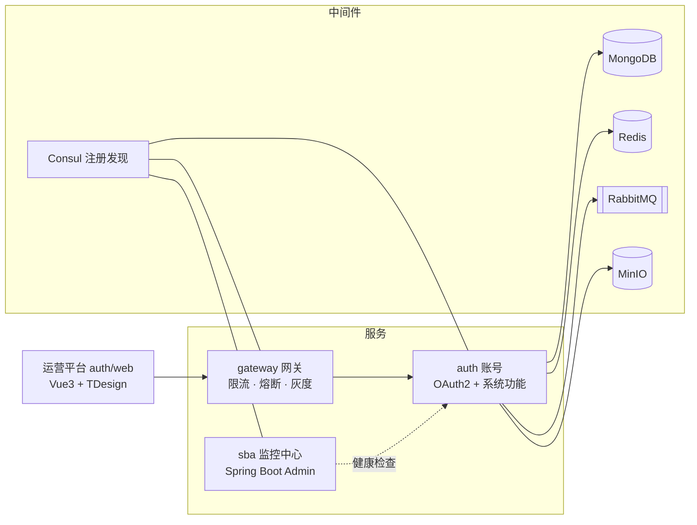

# cairo-platform

#### Cairo · 多租户 SaaS 微服务基础架构平台

[](https://github.com/lijiajia3515/cairo-platform/actions/workflows/ci.yml)


**Cairo** 是一套多租户 SaaS 微服务基础架构平台：以 **[auth 账号](auth/README.md)** 为核心（OAuth2 + JWT + 多租户 RBAC + 系统功能一体化），配套网关、监控中心、框架库与 Starter 集合。单仓库、单 Gradle 构建，采用 Gradle 官方推荐的现代构建架构（约定插件 + 版本目录 + 原生 BOM）。

## 特性

- **认证授权一体化**：账号服务既是 OAuth2 授权服务器（Spring Authorization Server + JWT），也内置文件、短信、通知、字典、业务日志等系统功能，单服务部署（`cairo-auth`）。
- **多租户层级模型**：`Tenant -订阅-> App -> Endpoint -> Subapp`，围绕 6 类认证主体组织认证与授权。
- **前后端分离 + 微服务**：后端 Java 17 / Spring Boot 3.5 / Spring Cloud 2025，前端 Vue 3.5 / Vite 7 / TDesign。
- **MongoDB 核心存储**：71 个集合的结构与基线数据全部脚本化管理（`docs/auth/db/` 唯一权威源）。
- **工程化优先**：32 个 Gradle 子应用共享一套约定插件，子应用 `build.gradle` 通常只有 `plugins {}` + `dependencies {}` 两段；CI 全仓测试并产出 boot jar 与前端 dist。

## 架构总览



## 快速开始（3 步）

完整步骤见 **[docs/quickstart.md](docs/quickstart.md)**。

**① 环境**：JDK 17 · Node 24 + pnpm 11 · MongoDB · Redis · RabbitMQ · MinIO · **Consul（必需）**

**② 起中间件 + 初始化数据库**：

```bash
docker run -d --name consul -p 8500:8500 hashicorp/consul:latest agent -dev -client 0.0.0.0
cd docs/auth/db && mongosh <uri> --file init.js   # 重建 71 个集合结构（mongosh 须在 db/ 下执行）
cd docs/auth && node scripts/import-menus.cjs      # 导入菜单/权限基线（需服务已启动 + admin）
```

**③ 起服务 + 前端**：

```bash
./gradlew :auth:service:bootJar
cd auth/web && corepack enable && pnpm install && pnpm dev   # 运营平台：5173
```

> Consul 默认地址是主机名 `consul`（容器网络名），本地运行需 `--spring.cloud.consul.host=localhost` 覆盖；账号服务首次启动前需生成 OAuth2 签名 RSA 密钥对（见 [oauth-jwk/README.md](auth/service/src/main/resources/config/oauth-jwk/README.md)）。

## 文档导航

完整地图见 **[docs/README.md](docs/README.md)**，以下为常用入口：

| 文档 | 内容 |
|---|---|
| [快速开始](docs/quickstart.md) | 从零到跑通的完整步骤（环境/初始化/配置/验证） |
| [架构设计](docs/architecture.md) | 架构总览 / 模块划分 / 项目结构 / 技术栈 |
| [开发指南](docs/development/standards.md) | 开发规范 · [构建架构](docs/development/build-system.md) · [新增子应用](docs/development/new-module.md) |
| [部署与运维](docs/deployment.md) | CI / nginx / DB 运维 |
| [auth 账号](auth/README.md) | 平台核心：主体模型、认证体系、API 层、数据模型 |
| [运营平台前端](auth/web/README.md) | Vue3 + TDesign，环境 / 命令 / 列表页规范 |
| [网关](gateway/README.md) · [监控中心](sba/README.md) | 服务说明与运行配置 |

## 技术栈

| 分类       | 选型                                                            |
|------------|-----------------------------------------------------------------|
| 语言与构建 | Java 17 · Gradle 8.14.5（约定插件 + 版本目录 + 原生 BOM）        |
| 微服务框架 | Spring Boot 3.5.16 · Spring Cloud 2025.0.3 · OpenFeign + Resilience4j |
| 注册与发现 | Consul（gateway 兼作配置中心）                                  |
| 认证授权   | Spring Authorization Server + JWT（RSA 密钥对多组轮换）          |
| 存储       | MongoDB · Redis（Redisson）· MinIO + imgproxy                   |
| 消息 / 任务 | RabbitMQ · XXL-Job · Lock4j                                     |
| 观测       | Micrometer Tracing + Zipkin · Spring Boot Admin                 |
| 前端       | Vue 3.5 · Vite 7 · Pinia 3 · TDesign · Node 24 LTS + pnpm 11    |

## 开源协议

[MIT License](LICENSE)
