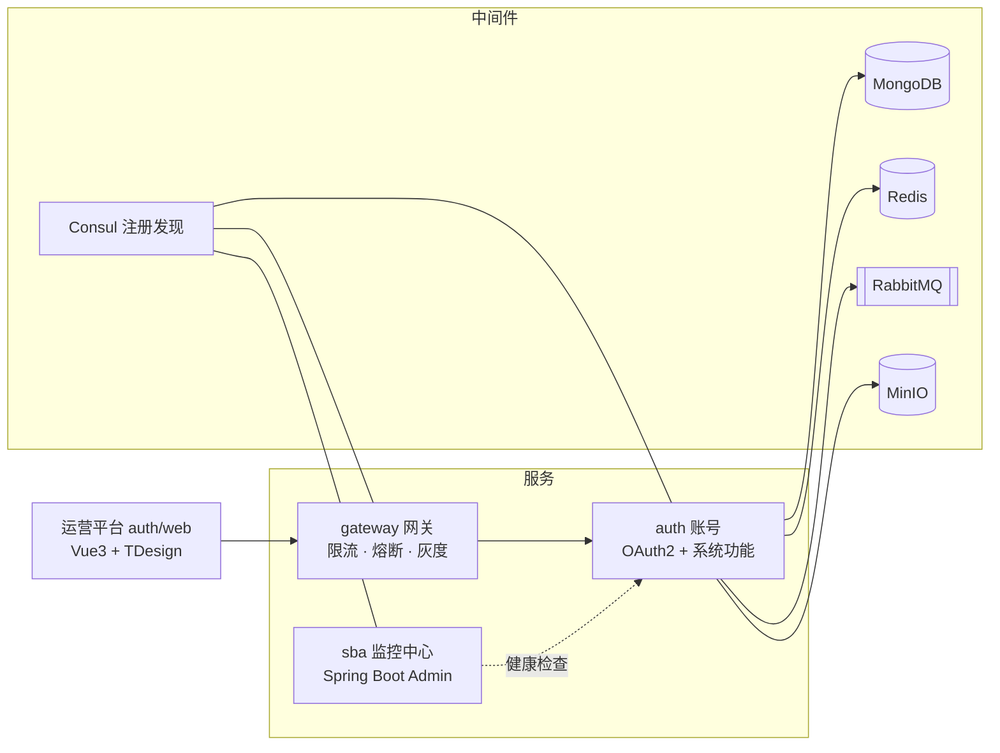

# 架构设计

## 总体架构

前后端分离 + 微服务：后端 Java 17 / Spring Boot 3.5 / Spring Cloud 2025，前端 Vue 3.5 / Vite 7 / TDesign。单仓库、单 Gradle 构建（见 [构建架构](development/build-system.md)）。



## 模块划分

| 模块 | 定位 | 文档 |
|---|---|---|
| **auth 账号** | 平台核心：OAuth2 授权服务器 + JWT + 多租户 RBAC + 系统功能一体化，单服务部署（`cairo-auth`） | [auth/README.md](../auth/README.md) · [docs/auth/](auth/README.md) |
| **gateway 网关** | 统一入口：业务返回包装、限流、熔断重试、灰度路由、追踪透传 | [gateway/README.md](../gateway/README.md) |
| **sba 监控中心** | Spring Boot Admin：服务发现、独立管理端口、健康告警 | [sba/README.md](../sba/README.md) |
| **framework 框架库** | 10 个子应用：返回体/异常/分页、Jackson 脱敏、Redis 前缀、MongoDB 命名策略、RabbitMQ 声明、Feign 扩展、LoadBalancer + BOM | 见[项目结构](#项目结构) |
| **starter 集合** | 7 个子应用：web / redis / mongodb / rabbitmq / xxljob 自动装配 + example 示例 | 见[项目结构](#项目结构) |

## 多租户层级模型

核心模型：`Tenant -订阅-> App -> Endpoint -> Subapp`，认证与授权围绕 6 类主体（Principal）组织：

| 主体 | 说明 |
|------|------|
| `Client` | 服务身份（Client_credentials） |
| `Account` | 平台账号（个人主体，跨应用） |
| `AppUser` | 应用用户（App 维度） |
| `SubappUser` | 子应用用户（Token 校验链） |
| `TenantAppUser` | 租户应用用户（最细粒度） |
| `TenantSubappUser` | 租户子应用用户（Token 校验链） |

认证授权细节（三层认证链、双层权限模型、API 主体面）见 [auth/README.md](../auth/README.md)。

## 项目结构

子应用目录名即子应用名（Spring 风格）：`auth/domain/core/` 对应 Gradle 子应用 `:auth:domain:core`，发布为 `io.github.lijiajia3515.cairo.auth.domain:cairo-auth-domain-core`。

```
cairo-platform/
├── framework/            # 核心框架库（10 子应用）：返回体/异常/分页、Jackson 脱敏、Redis 前缀、
│                         #   MongoDB 命名策略与发号器、RabbitMQ 声明、Feign 扩展、LoadBalancer + BOM
├── starter/              # Spring Boot Starter 集合（7 子应用）：web / redis / mongodb / rabbitmq /
│                         #   xxljob 自动装配 + example 示例应用
├── auth/                 # 账号（13 子应用）——平台核心，详见 auth/README.md
│   ├── core/             #   框架层：认证链、上下文、幂等、签名、分布式锁、SNS、审计
│   ├── domain/           #   业务领域层：账号 / 应用 / 客户端 / 开放接口 / 企业应用 / Web 管理
│   ├── sdk/              #   Feign Client 层（供其他微服务调用）
│   ├── service/          #   Spring Boot 主应用（45 个业务子应用）
│   ├── starter/service/  #   自动装配（供其他服务引入 auth starter）
│   ├── web/              #   运营平台前端（Vue 3.5 + Vite 7 + Pinia 3 + TDesign）
│   └── docs/             #   文档中枢：db/ 权威源 + 可读快照 + 导入脚本
├── gateway/              # Spring Cloud Gateway 网关
├── sba/                  # Spring Boot Admin 监控中心
├── nginx/                # nginx 部署配置（Dockerfile + 反向代理）
├── build-logic/          # 构建逻辑（included build）：约定插件 + 发布约定 + artifactId 推导
├── gradle/libs.versions.toml  # 版本目录：所有第三方版本与 BOM 坐标
└── settings.gradle       # 子应用注册 + includeBuild('build-logic') + 集中仓库声明
```

## 技术栈

| 分类         | 选型                                                                                     |
|--------------|------------------------------------------------------------------------------------------|
| 语言与构建   | Java 17 · Gradle 8.14.5（约定插件 + 版本目录 + 原生 BOM）                                 |
| 微服务框架   | Spring Boot 3.5.16 · Spring Cloud 2025.0.3 · OpenFeign + Resilience4j                    |
| 注册与发现   | Consul（gateway 兼作配置中心）                                                            |
| 认证授权     | Spring Authorization Server + JWT（RSA 密钥对多组轮换）                                  |
| 存储         | MongoDB（71 集合）· Redis（Redisson）· MinIO + imgproxy                                  |
| 消息         | RabbitMQ（Topic 交换机 + 声明式队列）                                                    |
| 观测         | Micrometer Tracing + Zipkin · Spring Boot Admin 3.5.10                                   |
| 任务与锁     | XXL-Job 3.4.2 · Lock4j                                                                   |
| 前端         | Vue 3.5 · Vite 7 · Pinia 3 · TDesign · Node 24.20.0 LTS + pnpm 11.24.0                   |

## 代码规模

| 指标           | 数值                            |
|----------------|---------------------------------|
| Gradle 子应用  | 32                              |
| MongoDB 集合   | 71                              |
| 菜单 / 权限点  | 45 / 169                        |
| API 面控制器/端点 | 166 / 701（清单见 [api-surface.md](auth/api/api-surface.md)） |

> 数字以权威源为准：子应用数 → `settings.gradle`；集合数 → `docs/auth/db/`；菜单/权限 → `docs/auth/db/data/`；API 面 → [api-surface.md](auth/api/api-surface.md)。

## 相关文档

- [快速开始](quickstart.md)：从零跑通
- [构建架构](development/build-system.md)：约定插件 / 版本目录 / BOM / 发布
- [auth 账号](../auth/README.md)：认证授权与主体模型设计
